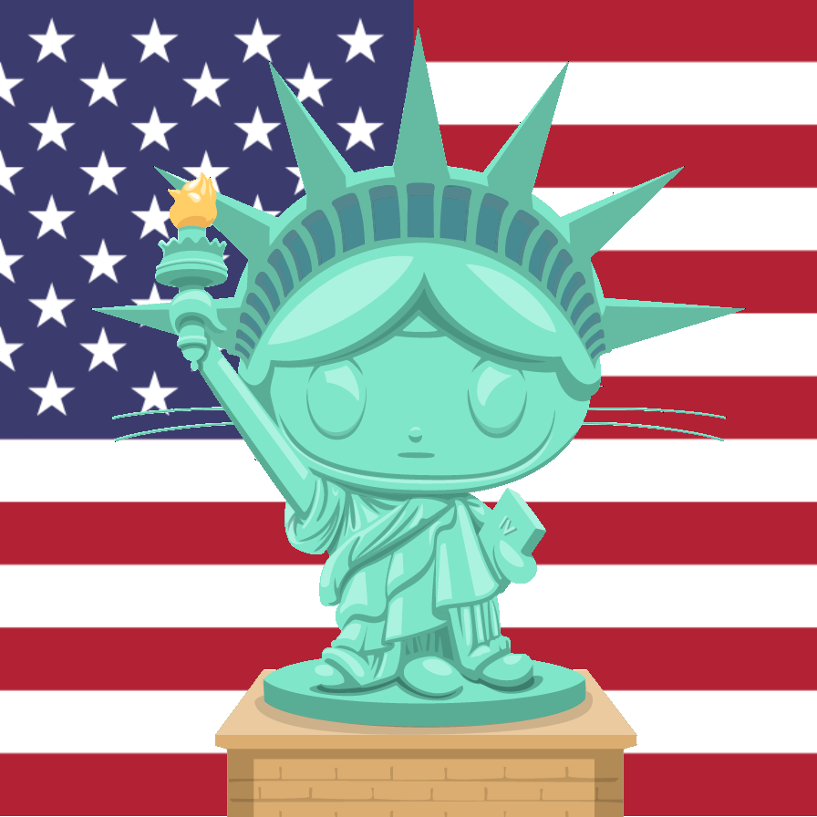

# Open Campaign

Because Freedom should be Free

## What Open Campaign is

Open Campaign is an Open Source platform to be used by Political Candidates at the Local, State, and National levels.

## What Open Campaign does

It allows a Candidate and his or her team to manage a homepage, receive donations, organize volunteers.

It allows volunteers to communicate with each other, reach out to voters, do other stuff

It allows voters to research the candidates issues, get involved with social media, and make donations

## How to use Open Campaign

Launch it with Heroku

## Who we are

This is the Doge Walkers' submission for the 2015 Rails Rumble

